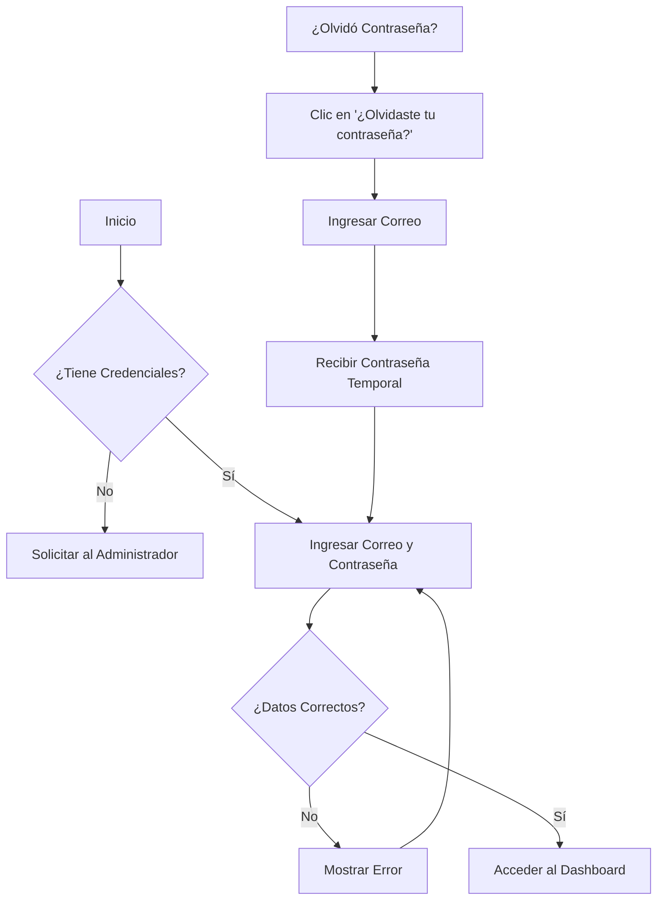
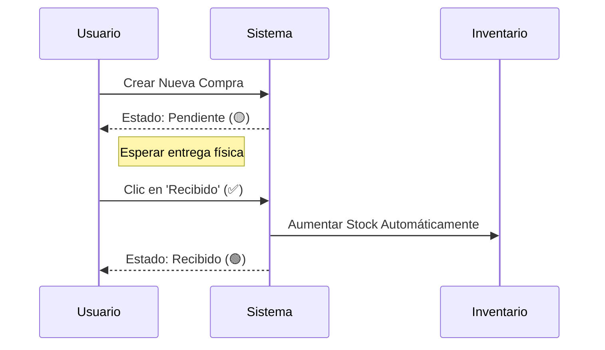
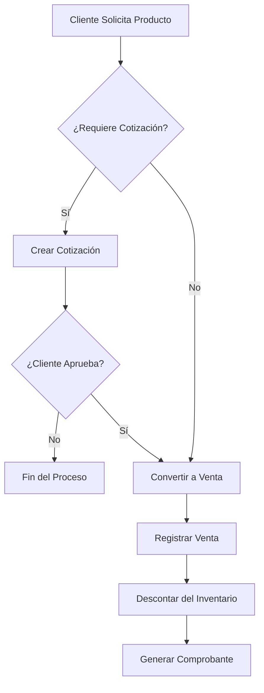
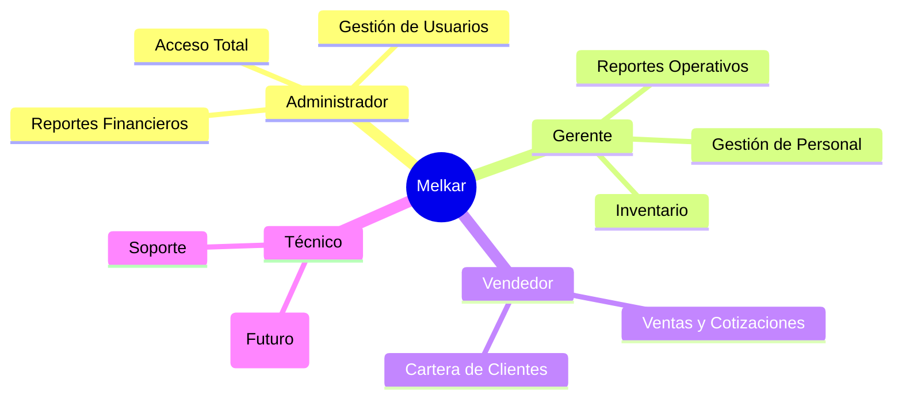

# Manual de Usuario - Melkar Refrigeración

Bienvenido al manual de usuario del sistema de gestión **Melkar**. Esta guía está diseñada para ayudarle a navegar y utilizar todas las funciones del sistema para administrar eficientemente las operaciones de refrigeración, inventario, ventas y personal.

---

## Índice

1. [Acceso al Sistema](#1-acceso-al-sistema)
2. [Tablero Principal (Dashboard)](#2-tablero-principal-dashboard)
3. [Gestión de Inventario y Productos](#3-gestión-de-inventario-y-productos)
4. [Compras y Proveedores](#4-compras-y-proveedores)
5. [Ventas y Clientes](#5-ventas-y-clientes)
6. [Personal y Administración](#6-personal-y-administración)
7. [Preguntas Frecuentes](#7-preguntas-frecuentes)

---

## 1. Acceso al Sistema

### Iniciar Sesión



Para ingresar al sistema, diríjase a la pantalla de inicio:
1. Ingrese su **Correo Electrónico**.
2. Ingrese su **Contraseña**.
3. Haga clic en el botón **"Ingresar"**.

> **Nota:** Si es su primera vez ingresando, solicite sus credenciales al Administrador del sistema.

### Recuperar Contraseña
Si ha olvidado su contraseña:
1. En la pantalla de login, haga clic en **"¿Olvidaste tu contraseña?"**.
2. Ingrese su correo electrónico registrado.
3. El sistema le proporcionará una **contraseña temporal** (o enviará instrucciones, según la configuración) para que pueda acceder y cambiarla posteriormente.

---

## 2. Tablero Principal (Dashboard)

Al ingresar, verá el **Tablero de Control**, que ofrece una vista rápida del estado de la empresa:
- **Alertas de Stock:** Visualice rápidamente qué productos tienen pocas unidades (crítico o bajo).
- **Estadísticas Clave:** Resumen de ventas totales, valor del inventario y estado de las compras.
- **Gráficos:** Visualización del rendimiento mensual (si está habilitado para su rol).

---

## 3. Gestión de Inventario y Productos

### Módulo de Productos
Aquí encontrará el catálogo completo de artículos.
- **Estado del Stock:** Los productos se marcan automáticamente con etiquetas de colores:

  ```mermaid
  graph LR
      A[Producto] --> B{Cantidad de Stock}
      B -- Mayor a 10 --> C[🟢 En Stock]
      B -- Entre 5 y 10 --> D[🟡 Stock Bajo]
      B -- Menor a 5 --> E[🔴 Crítico]
  ```

  - 🟢 **En Stock:** Cantidad suficiente.
  - 🟡 **Stock Bajo:** Entre 5 y 10 unidades.
  - 🔴 **Crítico:** Menos de 5 unidades.

### Módulo de Inventario
Utilice este módulo para realizar ajustes manuales.
- **Ajustar Inventario:** Haga clic en el botón **"Ajustar Inventario"** para registrar entradas o salidas manuales (por ejemplo, por merma, regalo o corrección).
  - Seleccione el producto.
  - Indique si es **Entrada** o **Salida**.
  - Ingrese la cantidad y el motivo.
- **Historial de Movimientos:** Consulte la pestaña "Movimientos" para ver una auditoría completa de quién modificó el inventario y cuándo.
- **Exportar:** Puede descargar el inventario actual a formato Excel.

---

## 4. Compras y Proveedores

### Módulo de Proveedores
Administre la lista de empresas que suministran productos.
- Registre nuevos proveedores con su Nombre, NIT, Teléfono y Ubicación.
- Mantenga actualizada la información de contacto para agilizar los pedidos.

### Módulo de Compras
Gestione el reabastecimiento de productos.
1. **Nueva Compra:** Haga clic en "Nueva Compra", seleccione el proveedor y añada los productos requeridos. El sistema calculará automáticamente los subtotales y el total.
2. **Estado de la Orden:**
   - Las compras nuevas aparecen como **"Pendiente"** (color ámbar).
   - **Recibir Mercancía:** Cuando lleguen los productos físicos, busque la orden en la lista y presione el botón verde **"Recibido"**. Esto **aumentará automáticamente el stock** de los productos en el inventario.



---

## 5. Ventas y Clientes

### Módulo de Clientes
Base de datos de sus compradores.
- Registre la información de contacto y dirección para facilitar la facturación y los despachos.

### Cotizaciones
Genere presupuestos formales para sus clientes sin afectar el inventario.
- Puede crear cotizaciones detalladas y, si el cliente aprueba, convertirlas futuramente en ventas.

### Módulo de Ventas
Registre las salidas de mercancía por venta directa.



- Seleccione el cliente y los productos.
- Al confirmar una venta, el **stock se descuenta automáticamente** del inventario.

---

## 6. Personal y Administración

### Módulo de Empleados
Gestione la información de su equipo de trabajo.
- **Nuevo Empleado:** Al crear un empleado, debe ingresar sus datos básicos.
- **Asignación de Cargos:** Puede seleccionar uno o varios cargos para un mismo empleado:
  - **Gerente**
  - **Técnico**
  - **Vendedor**
- Haga clic en los cargos deseados para activarlos (se resaltarán en azul).

### Módulo de Usuarios (Solo Administradores)
Control de acceso al sistema informático.



- **Crear Usuarios:** Asigne un nombre, correo y rol (Administrador, Vendedor, Gerente) para dar acceso al sistema.
- **Roles y Permisos:** El **Administrador** tiene acceso total a todos los módulos (Reportes, Ventas, Usuarios, etc.). Otros roles verán un menú limitado según sus funciones.
- **Seguridad:** Puede cambiar contraseñas o desactivar el acceso a usuarios que ya no laboran en la empresa.

---

## 7. Preguntas Frecuentes

**¿Por qué no veo todos los módulos en el menú?**
El sistema ajusta el menú lateral según su **Rol**. Si es Vendedor, es posible que no vea opciones administrativas como "Usuarios" o "Reportes". Si cree que es un error, contacte al Administrador.

**¿Cómo corrijo un error en el stock?**
Vaya al módulo **Inventario** y realice un "Ajuste de Inventario" de tipo Salida o Entrada con el motivo "Corrección".

**¿Puedo tener un empleado con múltiples funciones?**
Sí, en la ficha del empleado puede marcar simultáneamente que es "Vendedor" y "Técnico".

---
*Melkar Refrigeración © 2026 - Documentación Confidencial*
